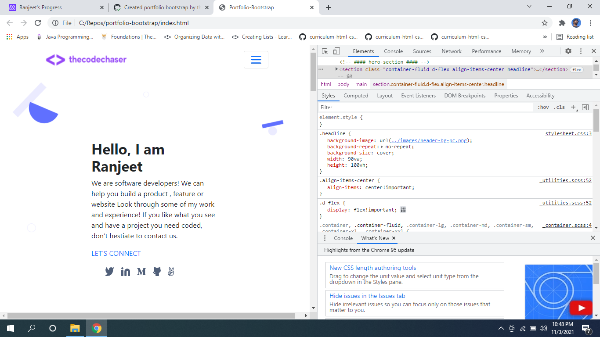
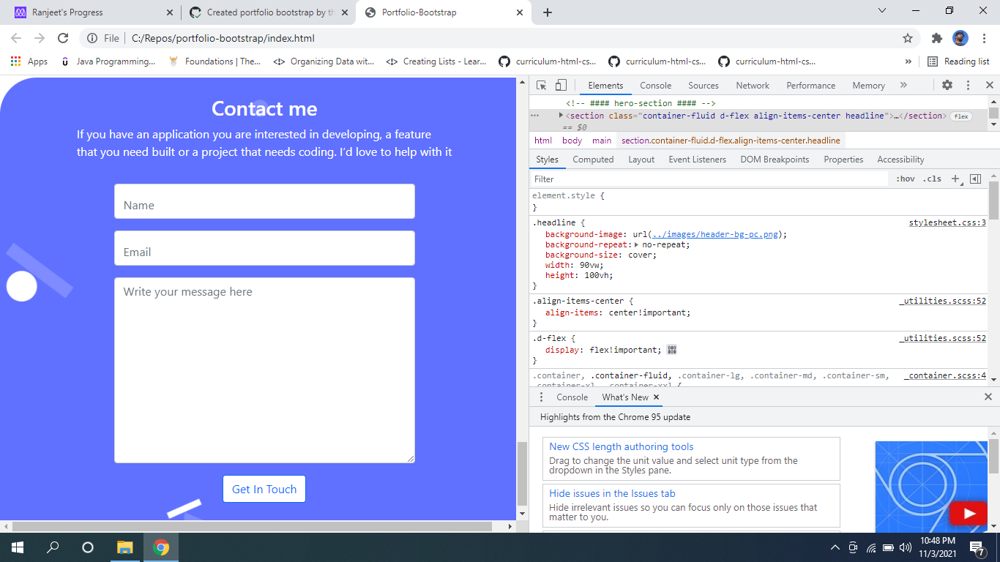
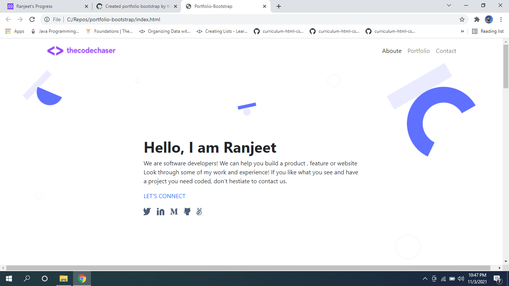
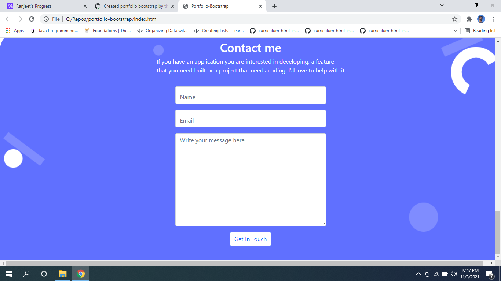

# Portfolio-Bootstrap

> Portfolio-bootstrap project is my personal portfolio with my details and previous project works and includes contact me form. This project is completely responsive for mobile and desktop. and developed by completely Bootstrap framework

## Screenshots:

## Mobile

## Desktop

Porject's features are added into seperate branch to keep main branch safe.

## Built With

- HTML and CSS
- Bootstrap
- Javascript

## Online live link

[Visit project online](https://thecodechaser.github.io/portfolio-bootstrap)

## Getting Started

To get a local copy up and running follow these simple example steps.

## Visit And Open Files

[Visit Repo](https://github.com/thecodechaser/portfolio-bootstrap)

## Download Repo

[Download Repo](https://github.com/thecodechaser/portfolio-bootstrap/archive/refs/heads/main.zip)

## Authors

👤 **Ranjeet Singh**

- GitHub: [@githubhandle](https://github.com/thecodechaser)
- Twitter: [@twitterhandle](https://twitter.com/thecodechaser)
- LinkedIn: [LinkedIn](https://linkedin.com/in/thecodechaser)

## 🤝 Contributing

Contributions, issues, and feature requests are welcome!

Feel free to check the [issues page](https://github.com/thecodechaser/portfolio-bootstrap/issues).

## Show your support

Give a ⭐️ if you like this project!

## Acknowledgments

- Inspiration: Microverse

## 📝 License

This project is [MIT](./MIT.md) licensed.
